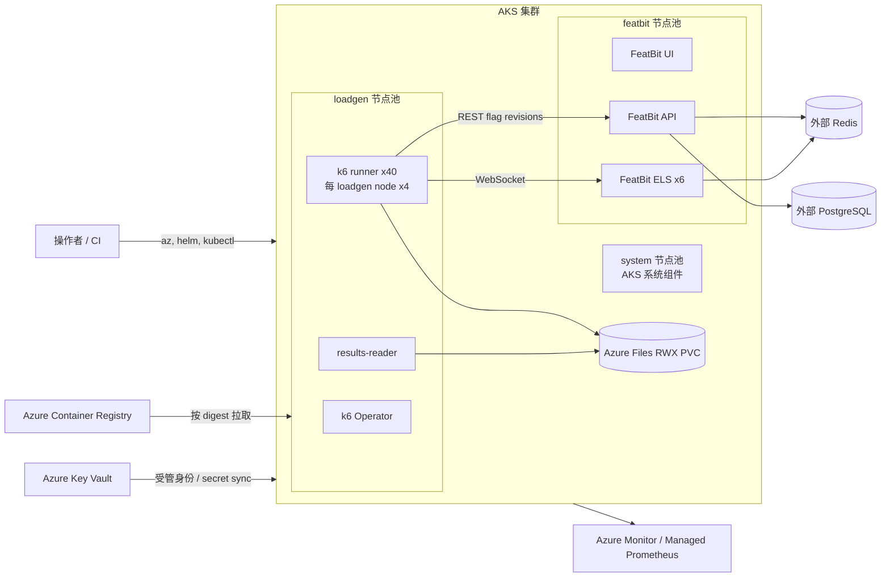

<a id="top"></a>

# AKS 负载测试迁移与运行指南

本文说明如何把本仓库的 FeatBit WebSocket 负载测试从 Docker Desktop Kubernetes
迁移到 Azure Kubernetes Service（AKS）。目标是让 FeatBit、k6 Operator 和实际负载都在
Azure 中运行，并通过资源隔离和监控判断传播延迟来自负载生成器还是 FeatBit 服务端。

- 测试行为、Profile 和通过条件见[根 README](../README.md)。
- 单机流程演练见[Docker Desktop 指南](README.md)。

> AKS 必须使用本文列出的 `bootstrap-aks.ps1`、显式 `-KubeContext` 配置脚本和
> `testrun-aks.yaml`。本地的 `bootstrap.ps1`、`run-test.ps1` 与 `collect-results.ps1`
> 仍保留 Docker Desktop 假设，不要删除或绕过其中的 context 保护。

## 导航（按执行顺序）

- [方案、资源与测试不变量](#结论先行)
- [1. 检查前置条件](#1-前置条件)
- [2. 使用 Terraform 创建 AKS 与 ACR](#2-使用-terraform-创建或准备-aks)
- [3. 部署并验证 FeatBit](#3-部署并验证-featbit)
- [4–5. 安装 k6 Operator 并准备结果存储](#4-安装-k6-operator-并隔离节点)
- [6. 配置 access token、Server SDK secret 与 controller](#6-配置测试凭据与-controller)
- [7–8. 构建 runner 镜像并配置 TestRun](#7-构建并固定-runner-镜像)
- [9–11. 完成 Gate 并执行测试](#9-仓库适配清单)
- [传播延迟归因](#12-如何判断传播延迟瓶颈)
- [故障处理与官方参考](#常见问题)

如果 FeatBit 已部署且你已经拿到 access token，直接从
[第 6 节“配置测试凭据与 controller”](#6-配置测试凭据与-controller)继续。

## 结论先行

AKS growth 使用独立、分布式的负载生成器，并固定 FeatBit 副本数和资源边界：

- growth 是 10,000 条连接、`parallelism >= 5`；尾延迟对照固定使用 p40、
  每 runner 250 条、每个 loadgen node 4 Pods；
- growth-plus 是 20,000 条连接、`parallelism >= 10`；推荐 p10 时每 runner 2,000 条；
- 两者均预置 20 个 flags，只测 flag-01；flag-02 用于满连接后不计分预热；
- ELS 固定为 6 个副本，每个 `500m CPU / 256Mi` request、
  `1 CPU / 512Mi` limit，HPA 关闭；
- runner 分别独占带 taint 的 loadgen 节点，不设置 CPU limit；
- FeatBit 和 runner 不共享节点；测量期间关闭自动扩缩容并停止部署；
- 使用 ACR 中按 Git SHA 构建的不可变镜像，并记录最终 image digest；
- 使用 Azure Files CSI 的 `ReadWriteMany` PVC 保存 JSON/HTML 结果；
- 至少采集 runner、ELS、API、Redis、PostgreSQL 和节点级指标。

历史 50k 实验中，5,000 连接单 runner 的内存峰值约为 `5.33 GiB`。20k growth-plus p10
暂时继续使用
`Standard_D4ds_v5` 与每 runner `6Gi` request、`10Gi` limit；D2 节点加上 DaemonSet/OS
工作集后余量过小，不在同一轮容量拐点实验中同时更换 generator 规格。专用节点不设置
CPU limit，避免 CFS throttling 人为抬高 `probe_sync_latency_ms`。

## 支持边界

| 仓库内容 | AKS 可用性 | 迁移动作 |
| --- | --- | --- |
| `k6/server-streaming.js` 与 `k6/lib/` | 已支持分布式 runner | runner 1 独占 controller，连接阈值按执行段计算 |
| `k8s-infra/Dockerfile.k6` | 可复用 | 用 Git SHA tag 构建并固定 digest |
| `k8s-infra/templates/testrun-aks.yaml` | AKS 参考模板 | 可配置 parallelism、分离调度、唯一报告路径和 RWX PVC |
| `k8s-infra/manifests/aks-loadtest-base.yaml` | 可直接应用 | `featbit-loadtest` namespace、Azure Files RWX PVC、loadgen results-reader |
| `k8s-infra/manifests/local-base.yaml` | 不可直接用 | RWO PVC 改为 Azure Files CSI RWX，并增加调度 |
| `k8s-infra/values/featbit-local.yaml` | 不可直接用 | 删除 NodePort/本地数据组件假设，新增节点隔离和云端依赖 |
| `k8s-infra/values/featbit-aks-internal.yaml` | 可用于临时 AKS | 内置 PostgreSQL/Redis、开放公网 LoadBalancer、target 节点调度，不用于生产 |
| `bootstrap-aks.ps1`、target/controller/flag 配置脚本 | AKS 可用 | 必须显式传入目标 `-KubeContext` |
| `bootstrap.ps1`、`run-test.ps1`、`collect-results.ps1` | 当前仅本地 | 保留 Docker Desktop 保护；growth/growth-plus 会拒绝本地单 runner |
| `render-aks-testrun.ps1`、`monitor-aks-testrun.ps1`、`collect-results-aks.ps1` | AKS 可用 | 渲染、资源峰值采样和完整证据归档 |
| `k8s-infra/terraform/aks/` | 可用 | 创建/销毁临时 AKS、ACR 与 system/featbit/loadgen 节点池 |

本地电脑或 Azure Cloud Shell 可以继续充当轻量控制端，执行 `az`、`helm` 和 `kubectl`；
k6 的连接与测量负载必须在 AKS runner Pod 内产生。

## 推荐拓扑



最低可接受配置是同一 AKS 集群中的独立、带 taint 的 `featbit` 与 `loadgen` 用户节点池。
需要形成正式容量结论时，优先使用独立的 target AKS 与 loadgen AKS；此时 ELS/API 必须通过
Internal Load Balancer、私网对等和私有 DNS 暴露给 loadgen，不能继续使用同集群的
`*.svc.cluster.local` 地址。

## 起始资源模型

下面是 growth 首次迁移的起点，不是最终容量承诺。VM SKU 是否可用、可用区支持情况和订阅
quota 必须在目标 region 中先确认。

| 节点池 | 示例 | 数量 | 用途 |
| --- | --- | ---: | --- |
| `system` | `Standard_D2ds_v5` | 1 | 临时集群的 CoreDNS、CSI 等系统组件 |
| `featbit` | `Standard_D4ds_v5` | 3 | UI、API、6 个 ELS 及临时 PG/Redis；与 runner 隔离 |
| `loadgen` | `Standard_D4ds_v5` | 10 | 当前 growth 尾延迟对照固定 10 节点、每节点 4 runners |

首次 AKS 对照跑使用以下工作负载配置：

| 组件 | 副本 | Request | Limit | 说明 |
| --- | ---: | --- | --- | --- |
| ELS | 6 | `500m / 256Mi` | `1 CPU / 512Mi` | 三个 target 节点严格 `2 + 2 + 2`，HPA 关闭 |
| API | 1 | `100m / 256Mi` | `500m / 1Gi` | 与本地配置一致 |
| UI | 1 | `100m / 128Mi` | `500m / 512Mi` | 不在测量数据面上 |
| 内置 PostgreSQL | 1 | `1 CPU / 2Gi` | 仅 `4Gi` memory | 无 CPU limit，`32Gi managed-csi-premium` |
| 内置 Redis | 1 | `1 CPU / 1Gi` | 仅 `2Gi` memory | 无 CPU limit，`8Gi managed-csi-premium` |
| growth runner | >=5 | 每个 `2 CPU / 4Gi` | 每个仅 `8Gi` memory | p5 时 2,000 连接/runner |
| growth p40 runner | 40 | 每个 `250m / 768Mi` | 每个仅 `1536Mi` memory | 10 nodes × 4 Pods；250 连接/runner |
| growth-plus runner | >=10 | 每个 `3 CPU / 6Gi` | 每个仅 `10Gi` memory | p10 时 2,000 连接/runner |

6 个 ELS 通过 `topologySpreadConstraints` 在三个 target 节点上严格形成 `2 + 2 + 2`。
UI/API 与内置依赖共享 target pool，但不与 runner 共享节点。实际容量判断以
`Allocatable`、Pod placement 和 15 秒采样的容器峰值为准。

### VM 价格快照

以下为 2026-07-23 从 Azure Retail Prices API 查询的 Linux、按需、非 Spot 零售价，货币为
USD；月价按 730 小时计算。实际账单受协议折扣、税费和 region 影响。

| SKU | East Asia / 小时 | East Asia / 月 | Southeast Asia / 小时 | Southeast Asia / 月 |
| --- | ---: | ---: | ---: | ---: |
| `Standard_D2ds_v5` | $0.155 | $113.15 | $0.141 | $102.93 |
| `Standard_D4ds_v5` | $0.310 | $226.30 | $0.282 | $205.86 |
| `Standard_D8ds_v5` | $0.620 | $452.60 | $0.564 | $411.72 |
| `Standard_D16ds_v5` | $1.240 | $905.20 | $1.128 | $823.44 |

当前 growth 拓扑（1 个 D2 + 9 个 D4）的 VM 合计约为 East Asia `$2.945/小时`；
growth-plus 将 loadgen 扩至 10 后（1 个 D2 + 13 个 D4）约 `$4.185/小时`。这不包含磁盘、
Load Balancer/Public IP、ACR、Azure Files、监控、数据库、Redis、流量和 AKS Standard tier。
Terraform 默认使用 AKS Free tier 和 ACR Basic。可随时运行
[`get-vm-prices.ps1`](terraform/aks/get-vm-prices.ps1) 获取最新价格。

## 测试不变量

为保证本地与 AKS 结果可比较，每轮必须满足：

1. 使用专门的 FeatBit project/environment 和 `loadtest-sync-probe-*` flags。
2. Server SDK secret 与 OpenAPI access token 必须属于同一个 environment。
3. 同一 environment 同一时间只有一个 Pending 或 Running 的 TestRun。
4. growth 至少 p5、growth-plus 至少 p10；`-RunnersPerNode 1` 时使用
   `separate: true`，多 Pod/节点时使用 `separate: false` 加 topology spread。loadgen
   节点数至少为 `ceil(parallelism / runnersPerNode)`。
5. 测量期间固定节点数、Pod 副本数和 HPA 状态，不执行升级、部署或节点维护。
6. 所有节点与外部依赖保持时钟同步。该测试用 flag payload 的 `updatedAt` 计算传播延迟。
7. 记录 AKS 版本、节点 SKU/数量、Helm chart 版本、镜像 digest 和所有资源配额。
8. 让测试自然结束并收集报告；强制终止可能跳过 `teardown()` 的 baseline 恢复。

分布式运行只有 runner 1 操作 flags。`setup()` 先预热 API/Redis/ELS 控制路径；所有 runner
等待同一个 60 秒 setup barrier 后开始 ramp。全部连接建立并 stabilization 后，runner 1 再用
flag-02 执行一次不计分的 `baseline -> rev-001 -> baseline` fan-out，所有连接覆盖成功后才
变更计分的 flag-01。结束时 runner 1 等待 30 秒让其他 runner drain，再恢复 baseline。

## 1. 前置条件

控制端需要：

- Azure CLI、PowerShell 7、Git、Helm 3.7+ 和 `kubectl`；
- 有权创建或使用 AKS、ACR、节点池、监控和 secret 方案的 Azure 身份；
- 已确认目标 region 的 vCPU quota、VM SKU 和可用区；
- 一个不会影响真实用户的 FeatBit 测试 environment；
- PostgreSQL 和 Redis 的容量、网络与监控方案。

先确认 subscription、region、SKU 和 quota：

```powershell
$subscriptionId = "<subscription-id>"
$location = "<azure-region>"

az account set --subscription $subscriptionId
az aks get-versions --location $location --output table
az vm list-skus --location $location --resource-type virtualMachines `
  --query "[?name=='Standard_D2ds_v5' || name=='Standard_D4ds_v5'].{name:name,zones:locationInfo[0].zones,restrictions:restrictions}" `
  --output table
```

不要把 Server SDK secret、OpenAPI token、JWT key 或数据库密码写入变量文件、Git、命令行参数、
CI 日志或本文。任何曾粘贴到聊天或日志的 access token 都应视为已暴露并轮换。

## 2. 使用 Terraform 创建或准备 AKS

新建临时环境时使用仓库提供的
[`terraform/aks/`](terraform/aks/README.md)。当前示例复用已有的 `featbit-devtest` resource
group，在其中创建 AKS、ACR 和 ACR pull 权限，并创建 system/featbit/loadgen 节点池；
`terraform destroy` 会删除这些测试资源，但保留 `featbit-devtest` 本身。

AKS 强制使用第二个、独立的 node resource group 保存 VMSS、网络和磁盘，不能把它与主组
合并。脚本将其固定为 `featbit-devtest-nodes`；该组必须事先不存在，并会在 AKS 删除时由
Azure 自动删除。因此 Azure Portal 中会看到两个名称相邻的组，而不是无法识别的默认
`MC_*` 名称。`featbit-devtest` 的元数据 location 是 `westus3` 不影响资源部署：
Terraform 的 `location = "eastasia"` 仍会把 AKS 和 ACR 建在香港。

```powershell
Push-Location .\k8s-infra\terraform\aks
Copy-Item terraform.tfvars.example terraform.tfvars
# 示例已配置 featbit-devtest；编辑 subscription_id、owner 和 expires-at，不要写 secret。

terraform init
terraform validate
terraform plan -out featbit-aks.tfplan
terraform apply featbit-aks.tfplan

$resourceGroup = terraform output -raw resource_group_name
$aksName = terraform output -raw aks_name
$acrName = terraform output -raw acr_name
$credentialsCommand = terraform output -raw get_credentials_command
Pop-Location

Invoke-Expression $credentialsCommand

$aksContext = (kubectl config current-context).Trim()
kubectl --context $aksContext get nodes `
  -L agentpool,workload,kubernetes.azure.com/mode `
  -o wide
```

使用现有 AKS 时跳过 Terraform apply，但仍要创建同等的 taint/label 隔离节点池。确认只有
目标 AKS context 后再继续。不要在 AKS context 下运行
`k8s-infra/scripts/bootstrap.ps1`；它会并且应该拒绝执行。

## 3. 部署并验证 FeatBit

首次 AKS 对照跑固定 FeatBit chart `0.9.13` / app `5.4.4`。本仓库支持两个明确分开的
部署 Profile：

1. 临时 dev/test 集群使用
   [`featbit-aks-internal.yaml`](values/featbit-aks-internal.yaml)，部署 chart 自带的单副本
   PostgreSQL/Redis，并通过开放公网 LoadBalancer 提供短期人工验收入口；context、
   Secret、Helm、验证和创建测试 access token 的完整命令见
   [Terraform AKS README](terraform/aks/README.md#deploy-featbit-with-bundled-postgresql-and-redis)。
2. 正式容量测试使用独立的托管 PostgreSQL/Redis。下面的外部依赖方案保留为容量基线，
   但对应的 `featbit-aks.yaml` 尚未固化。

内置数据组件会与 UI/API/ELS 一起运行在 `featbit` 节点池，会改变目标池的 CPU、内存、磁盘
和网络构成。因此结果必须标记为 `internal-pg-redis`，不能与外部托管依赖的结果混为同一基线。
该 Profile 为 PostgreSQL/Redis 各预留 `1 CPU`，取消 CPU hard limit，并使用
`managed-csi-premium`，避免原来的 `500m` CFS quota 和默认磁盘先形成人工瓶颈；仍需用
数据库、Redis 和节点指标证明它们没有限制本次运行。
该 Profile 的公网 LoadBalancer 是开放 Internet 的临时 HTTP 入口，不等同于 TLS；长期环境必须
改用 HTTPS ingress/Front Door 和网络访问控制。立即修改默认密码。人工验收和 token 创建必须在
warm-up 前结束，测量窗口内停止所有 UI 和公网 API 操作。

云端容量测试推荐：

- `architecture.tier: standard`、`database: postgres`；
- `postgresql.enabled: false`，连接独立 PostgreSQL；
- `redis.enabled: false`，连接独立 Redis；
- UI/API/ELS 使用 `ClusterIP`，需要公网人工验收时通过带 TLS 和来源 IP 限制的 ingress 暴露；
- UI/API/ELS 都选择 `workload=featbit` 并容忍同名 taint；
- ELS 使用三个副本和 Pod anti-affinity，尽量分散到所有 target 节点；
- ELS 固定 `1 CPU` request/limit 和三个副本，ELS、API 的 HPA 在测量期间关闭；
- DAS 与 MongoDB 继续关闭，因为不在本测试的 Server SDK streaming 路径上。

关键 values 结构如下，所有 `<...>` 必须替换；secret 只引用名称和 key：

```yaml
architecture:
  tier: standard
  database: postgres

apiExternalUrl: "https://<private-api-host>"
evaluationServerExternalUrl: "https://<private-els-host>"

ui:
  replicaCount: 1
  service:
    type: ClusterIP
    port: 8081
  ingress:
    enabled: false
  nodeSelector:
    workload: featbit
  tolerations:
    - key: workload
      operator: Equal
      value: featbit
      effect: NoSchedule
  resources:
    requests: { cpu: 100m, memory: 128Mi }
    limits: { cpu: 500m, memory: 512Mi }

api:
  replicaCount: 1
  service:
    type: ClusterIP
    port: 5000
  ingress:
    enabled: false
  autoscaling:
    enabled: false
  nodeSelector:
    workload: featbit
  tolerations:
    - key: workload
      operator: Equal
      value: featbit
      effect: NoSchedule
  env:
    - name: Jwt__Algorithm
      value: HS256
    - name: Jwt__Key
      valueFrom:
        secretKeyRef:
          name: featbit-jwt-secret
          key: jwt-key
  resources:
    requests: { cpu: 100m, memory: 256Mi }
    limits: { cpu: 500m, memory: 1Gi }

els:
  enabled: true
  replicaCount: 3
  service:
    type: ClusterIP
    port: 5100
  ingress:
    enabled: false
  autoscaling:
    enabled: false
  rateLimiting:
    enabled: false
  nodeSelector:
    workload: featbit
  tolerations:
    - key: workload
      operator: Equal
      value: featbit
      effect: NoSchedule
  affinity:
    podAntiAffinity:
      preferredDuringSchedulingIgnoredDuringExecution:
        - weight: 100
          podAffinityTerm:
            topologyKey: kubernetes.io/hostname
            labelSelector:
              matchLabels:
                app.kubernetes.io/instance: featbit
                app.kubernetes.io/component: els
  resources:
    requests: { cpu: "1", memory: 512Mi }
    limits: { cpu: "1", memory: 1Gi }

das:
  enabled: false

postgresql:
  enabled: false
externalPostgresql:
  hosts:
    - "<postgres-host>:5432"
  database: featbit
  username: "<postgres-user>"
  existingSecret: featbit-postgresql-secret
  existingSecretPasswordKey: password

redis:
  enabled: false
externalRedis:
  hosts:
    - "<redis-host>:<redis-port>"
  db: 0
  user: "<redis-user-if-required>"
  existingSecret: featbit-redis-secret
  existingSecretPasswordKey: password
  ssl: true

mongodb:
  enabled: false
```

部署前先确认 chart 版本仍能与选定的 PostgreSQL/Redis 服务、TLS 和身份验证方式兼容；
不要用负载测试来首次验证数据库 migration。然后渲染、安装并确认 ELS endpoint 数量：

```powershell
helm repo add featbit https://featbit.github.io/featbit-charts/ --force-update
helm repo update featbit

helm upgrade --install featbit featbit/featbit `
  --version 0.9.13 `
  --kube-context $aksContext `
  --namespace featbit `
  --create-namespace `
  --values .\k8s-infra\values\featbit-aks.yaml `
  --wait `
  --timeout 20m

kubectl --context $aksContext -n featbit rollout status `
  deployment/featbit-els --timeout=10m
kubectl --context $aksContext -n featbit get pods,services,endpointslices -o wide
```

上面的安装命令要求先把审核后的 values 保存为
`k8s-infra/values/featbit-aks.yaml`；该文件当前尚未由仓库提供。

## 4. 安装 k6 Operator 并隔离节点

首次迁移沿用本地已验证的 chart `4.5.0` / app `1.5.0`。Operator 放到 loadgen 节点池，
避免占用 FeatBit 节点。推荐从仓库根目录执行可重复的 bootstrap；它同时应用第 5 节的
AKS base manifest，并拒绝没有正确 label/taint 的节点池。脚本使用隔离的临时 Helm
repository config/cache，不依赖或修改本机其他 Helm repo 的缓存：

```powershell
.\k8s-infra\scripts\bootstrap-aks.ps1 `
  -KubeContext $aksContext

kubectl --context $aksContext get crd testruns.k6.io
kubectl --context $aksContext -n k6-operator-system get pods -o wide
```

升级 Operator 是一次独立变更；不要在同一轮容量对比中同时升级 chart、k6 和 FeatBit。

## 5. 创建测试 namespace 与结果存储

本地 `ReadWriteOnce` PVC 在多节点 AKS 上可能导致 runner 与 `results-reader` 无法同时挂载。
AKS 使用 [`manifests/aks-loadtest-base.yaml`](manifests/aks-loadtest-base.yaml) 中的 Azure
Files CSI `ReadWriteMany` PVC；同一 manifest 也把 `results-reader` 固定到 loadgen 池。
第 4 节的 `bootstrap-aks.ps1` 已经应用该 manifest，下面先核验；只有跳过 bootstrap
进行手工安装时才需要执行 `kubectl apply`：

```powershell
kubectl --context $aksContext get storageclass azurefile-csi
kubectl --context $aksContext get csidriver file.csi.azure.com

# 仅用于手工安装路径；重复 apply 也是幂等的。
kubectl --context $aksContext apply `
  -f .\k8s-infra\manifests\aks-loadtest-base.yaml

kubectl --context $aksContext -n featbit-loadtest wait `
  --for=condition=Ready pod/results-reader `
  --timeout=5m

kubectl --context $aksContext -n featbit-loadtest get pod,pvc -o wide
```

应用正式 TestRun 前，用 `results-reader` 在 PVC 中创建、读取并删除一个临时文件，确认
UID/GID 和 mount options 可写。报告文件很小，标准 `azurefile-csi` 通常足够；只有证据显示
结果盘 I/O 影响测试时才升级存储层级。

## 6. 配置测试凭据与 controller

如果你刚拿到 FeatBit OpenAPI access token，从本节开始。还需要同一 environment 的
Server SDK secret：前者只用于创建和变更测试 flags，后者用于 k6 runner 连接 ELS。
两个值都会写入 `featbit-loadtest` namespace 的 Kubernetes Secret；runner 实际访问
FeatBit 时使用集群内的 `.svc.cluster.local` 地址，不经过公网 LoadBalancer。

推荐使用 AKS Workload Identity 和 Key Vault CSI/组织已有的 secret controller，把 Key Vault
内容同步为 Kubernetes Secret。仅启用 Key Vault CSI addon 不会自动创建这些 Secret；必须
显式配置 `SecretProviderClass`、访问角色和实际挂载/同步工作负载。

需要的 Kubernetes Secret contract：

| Namespace / Secret | Key | 用途 |
| --- | --- | --- |
| `featbit/featbit-jwt-secret` | `jwt-key` | API JWT 签名 |
| `featbit/featbit-postgresql-secret` | `password` | 外部 PostgreSQL |
| `featbit/featbit-redis-secret` | `password` | 外部 Redis |
| `featbit-loadtest/featbit-k6-secret` | `FEATBIT_SERVER_SECRET` | ELS Server SDK 连接 |
| `featbit-loadtest/featbit-k6-controller-secret` | `FEATBIT_API_ACCESS_TOKEN` | REST flag 管理 |

先应用 AKS base manifest，再通过安全提示输入凭据。不要把 token 或 Server SDK secret 写在
命令行字面量、values、Terraform、Git 或聊天中：

```powershell
$aksContext = "aks-featbit-load-testing"

kubectl --context $aksContext apply `
  -f .\k8s-infra\manifests\aks-loadtest-base.yaml

$serverSecret = Read-Host "FeatBit Server SDK secret" -AsSecureString
.\k8s-infra\scripts\configure-target.ps1 `
  -KubeContext $aksContext `
  -StreamingUrl "ws://featbit-els.featbit.svc.cluster.local:5100" `
  -ServerSecret $serverSecret
Remove-Variable serverSecret
```

在第二个 PowerShell 窗口执行下面的实际命令并保持窗口运行。看到
`Forwarding from 127.0.0.1:5000` 后，再回到第一个窗口：

```powershell
$aksContext = "aks-featbit-load-testing"
kubectl --context $aksContext -n featbit `
  port-forward service/featbit-api 5000:5000
```

回到第一个 PowerShell 窗口，通过该隧道查询 environment 并写入 controller 配置：

```powershell
$configurationApiUrl = "http://127.0.0.1:5000"
$accessToken = Read-Host "New FeatBit OpenAPI access token" -AsSecureString

# Read-only discovery: record the intended project/environment keys.
.\k8s-infra\scripts\configure-controller.ps1 `
  -KubeContext $aksContext `
  -AccessToken $accessToken `
  -ApiUrl $configurationApiUrl `
  -ListEnvironments

# Replace the two keys below with one row from the discovery output.
.\k8s-infra\scripts\configure-controller.ps1 `
  -KubeContext $aksContext `
  -AccessToken $accessToken `
  -ApiUrl $configurationApiUrl `
  -ProjectKey "<project-key>" `
  -EnvironmentKey "<environment-key>"

Remove-Variable accessToken
```

The local API call above reaches the ClusterIP Service through `kubectl port-forward`; it does not send the token over the public HTTP LoadBalancer. The stored runner value remains
`http://featbit-api.featbit.svc.cluster.local:5000`, and streaming remains
`ws://featbit-els.featbit.svc.cluster.local:5100`.

默认是两次正式 revision。需要 growth 的多次重复采样时，两个脚本必须传入完全相同的
revision 集合；例如 10 次变更：

```powershell
$revisionSet = ((1..10) | ForEach-Object { "rev-{0:D3}" -f $_ }) -join ","

.\k8s-infra\scripts\configure-target.ps1 `
  -KubeContext $aksContext `
  -StreamingUrl "ws://featbit-els.featbit.svc.cluster.local:5100" `
  -ServerSecret $serverSecret `
  -ExpectedRevisions $revisionSet

.\k8s-infra\scripts\prepare-probe-flags.ps1 `
  -KubeContext $aksContext `
  -ApiUrl "http://127.0.0.1:5000" `
  -ProbeFlagCount $rendered.ProvisionedProbeFlagCount `
  -ExpectedRevisions $revisionSet
```

10 次、每次间隔 30 秒需要至少 300 秒的 hold window，因此只用于 hold 足够长的 growth /
growth-plus；不要直接套到 smoke、baseline 或 baseline-plus。

非敏感配置保持与本地一致：

```yaml
apiVersion: v1
kind: ConfigMap
metadata:
  name: featbit-k6-target
  namespace: featbit-loadtest
data:
  FEATBIT_STREAMING_URL: ws://featbit-els.featbit.svc.cluster.local:5100
  PROBE_INITIAL_VALUE: baseline
  EXPECTED_REVISIONS: rev-001,rev-002
  STRICT_PATCH_DELIVERY: "false"
---
apiVersion: v1
kind: ConfigMap
metadata:
  name: featbit-k6-controller
  namespace: featbit-loadtest
data:
  AUTO_CONTROL_REVISIONS: "true"
  FEATBIT_API_URL: http://featbit-api.featbit.svc.cluster.local:5000
  FEATBIT_ENVIRONMENT_ID: "<environment-guid>"
  CONTROLLER_WARMUP_SETTLE_SECONDS: "2"
  CONTROLLER_START_DELAY_SECONDS: "5"
  CONTROLLER_REVISION_INTERVAL_SECONDS: "30"
  CONTROLLER_FINAL_SETTLE_SECONDS: "30"
```

The AKS TestRun template also declares `FEATBIT_STREAMING_URL` and `FEATBIT_API_URL` as explicit
runner environment variables. Kubernetes gives explicit `env` entries precedence over `envFrom`,
so a stale or accidentally public URL in either ConfigMap cannot redirect measured traffic through
the public LoadBalancers. The public IPs are only for browser-based manual verification.

OpenAPI token 至少需要在目标 environment 中读取、创建、archive、删除 flag 以及更新 targeting
的权限。上线前只检查 key 是否存在，不读取或打印 Secret 值。

## 7. 构建并固定 runner 镜像

使用 ACR Build 可避免本地 Docker 的 CPU/内存限制：

```powershell
$gitSha = (git rev-parse --short=12 HEAD).Trim()
$acrLoginServer = (az acr show `
  --resource-group $resourceGroup `
  --name $acrName `
  --query loginServer `
  --output tsv).Trim()

az acr build `
  --registry $acrName `
  --image "featbit-k6:$gitSha" `
  --file k8s-infra/Dockerfile.k6 `
  .

$imageDigest = (az acr repository show `
  --name $acrName `
  --image "featbit-k6:$gitSha" `
  --query digest `
  --output tsv).Trim()

$runnerImage = "$acrLoginServer/featbit-k6@$imageDigest"
$runnerImage
```

TestRun 使用 `$runnerImage` 的 digest 形式和 `imagePullPolicy: IfNotPresent`。修改任何 `k6/`
文件后都必须重新构建，不能复用旧 digest。

## 8. 配置 TestRun

AKS 使用 [`templates/testrun-aks.yaml`](templates/testrun-aks.yaml)，但该文件包含
`__RUNNER_IMAGE__`、`__RUN_ID__` 和 Profile 参数等占位符，不能直接 `kubectl apply`。
先从 smoke 开始，通过只渲染脚本生成一份可审核的 manifest：

```powershell
if ([string]::IsNullOrWhiteSpace($runnerImage)) {
    throw "runnerImage is missing. Complete section 7 or restore its digest first."
}

$rendered = .\k8s-infra\scripts\render-aks-testrun.ps1 `
  -Profile smoke `
  -KubeContext $aksContext `
  -RunnerImage $runnerImage `
  -Parallelism 2 `
  -Note "AKS smoke validation"

$runId = $rendered.RunId
$testRunFile = $rendered.ManifestPath
$testRunName = $rendered.TestRunName
$testRunFile
```

该脚本只执行只读检查、写入本地 `results/<run-id>-testrun.yaml` 和 metadata，并使用
`kubectl apply --dry-run=server` 验证 CRD；它不会在集群中创建 TestRun、Job 或 runner Pod。
必须先在 AKS 完成 smoke，再以相同命令依次渲染 baseline、baseline-plus、growth 和
growth-plus，不能因为本地测试通过就跳过 AKS 的较低档位。最低配置是 growth p5、
growth-plus p10。当前 10k 尾延迟对照固定使用：

```powershell
$rendered = .\k8s-infra\scripts\render-aks-testrun.ps1 `
  -Profile growth `
  -KubeContext $aksContext `
  -RunnerImage $runnerImage `
  -Parallelism 40 `
  -RunnersPerNode 4 `
  -RunnerCpuRequest 250m `
  -RunnerMemoryRequest 768Mi `
  -RunnerMemoryLimit 1536Mi `
  -Note "10k p40 tail-latency comparison"
```

渲染器会要求 10 个带 `workload=loadgen` 的节点，并通过 topology spread 严格形成每节点
4 Pods。

渲染后的关键配置为：

```yaml
spec:
  parallelism: <profile parallelism>
  # RunnersPerNode=1 时为 true；多 Pod/节点时由 topology spread 控制。
  separate: <true-or-false>

  initializer:
    image: <acr-login-server>/featbit-k6@sha256:<digest>
    imagePullPolicy: IfNotPresent
    nodeSelector:
      workload: loadgen
    tolerations:
      - key: workload
        operator: Equal
        value: loadgen
        effect: NoSchedule
    resources:
      requests: { cpu: 100m, memory: 128Mi }
      limits: { cpu: "1", memory: 512Mi }

  starter:
    nodeSelector:
      workload: loadgen
    tolerations:
      - key: workload
        operator: Equal
        value: loadgen
        effect: NoSchedule
    resources:
      requests: { cpu: 100m, memory: 128Mi }
      limits: { cpu: "1", memory: 512Mi }

  runner:
    image: <acr-login-server>/featbit-k6@sha256:<digest>
    imagePullPolicy: IfNotPresent
    nodeSelector:
      workload: loadgen
    tolerations:
      - key: workload
        operator: Equal
        value: loadgen
        effect: NoSchedule
    resources:
      requests:
        cpu: "<profile request>"
        memory: <profile request>
      limits:
        memory: <profile limit>
    env:
      - name: FEATBIT_STREAMING_URL
        value: ws://featbit-els.featbit.svc.cluster.local:5100
      - name: FEATBIT_API_URL
        value: http://featbit-api.featbit.svc.cluster.local:5000
      - name: LOADTEST_PARALLELISM
        value: "<parallelism>"
      - name: DISTRIBUTED_SETUP_BARRIER_SECONDS
        value: "60"
      - name: DISTRIBUTED_TEARDOWN_GRACE_SECONDS
        value: "30"
    # 专用节点不设 CPU limit；保留 envFrom、securityContext、volumeMounts 和 volumes。
```

k6 Operator `1.5.0` 把 runner hostname 固定为 `<testrun>-1` 至
`<testrun>-<parallelism>`，先让 runner 保持 paused，再由 starter 协调启动。脚本据此只让
runner 1 执行预热、revision controller 和 teardown；连接目标阈值按 parallelism 均分。
每个 setup 都补齐到 60 秒，保证控制路径预热完成后再开始 ramp；预热超时会使该轮 Invalid。
runner 1 在 teardown 前额外等待 30 秒，避免提前恢复 baseline。模板通过 Pod 名称生成各自的
`*-summary.json` 和 `*-report.html`，避免 RWX 文件冲突。

各 runner 的 percentile 不是一个自动合并的全局 percentile。每个 runner 都必须通过阈值，
因此相同连接数下的 SLO gate 仍然成立；如果报告需要一个精确的全局 percentile 数值，再从
Prometheus/原始时序输出聚合。分布式模式不在 runner 2 上要求 controller 计数；API 错误会
主动 abort，而所有 runner 的 revision coverage/final revision 阈值共同验证更新确实传播。
渲染脚本已经用当前集群的 CRD 验证以下字段。只有排查 CRD 版本时，才需要单独执行：

```powershell
kubectl --context $aksContext explain testrun.spec.runner.nodeSelector
kubectl --context $aksContext explain testrun.spec.runner.tolerations
kubectl --context $aksContext explain testrun.spec.runner.resources
```

执行第 10 节 Gate 前，人工审核 `$testRunFile`，确认：

- 不包含任何 `__[A-Z0-9_]+__` 占位符；
- `runner.image` 是 ACR `@sha256:` digest，而不是可变 tag；
- `initializer.image` 与 `runner.image` 是完全相同的 ACR digest，确保 initializer 能读取
  `/tests/k6/server-streaming.js`；
- `parallelism` 和 `separate` 与本轮 `Parallelism / RunnersPerNode` 一致；
- runner、starter 和 initializer 都要求 `workload: loadgen`；
- runner 的 API/streaming URL 都是 `.svc.cluster.local`；
- runner resources 与 metadata 中的渲染参数一致；当前 growth p40 固定为每 Pod
  `250m CPU / 768Mi` request、`1536Mi` memory limit 且无 CPU limit；
- baseline 与 baseline-plus 都在 environment 中保留 10 个 probe flags：
  `loadtest-sync-probe-01` 是唯一计分 flag；`loadtest-sync-probe-02` 在所有连接建立并完成
  stabilization 后执行一次不计分的 `baseline -> rev-001 -> baseline` 广播预热，随后才变更
  flag-01；其余 8 个始终保持 `baseline`。baseline 使用 1,000 条连接和 10/s ramp，
  baseline-plus 使用 3,000 条连接和 30/s ramp；两者都是 70 秒 measured hold，加上 60 秒
  setup barrier、30 秒 stabilization、10 秒 drain 和 30 秒 teardown grace，计划墙钟时间约为
  5 分钟。
- growth/growth-plus 都预置 20 个 flags，只计 flag-01，flag-02 做满连接预热；连接数与
  ramp 分别为 `10,000 / 100/s` 和 `20,000 / 200/s`，hold 均为 600 秒，计划墙钟时间约
  13.8 分钟。

## 9. 仓库适配清单

在第一次无人值守 AKS 运行前，至少完成并评审：

- [x] Terraform 创建/销毁临时 AKS、ACR 和隔离节点池。
- [x] AKS TestRun 模板支持两个分离 runner、唯一报告路径和 ACR image digest。
- [x] k6 脚本在分布式运行中只由 runner 1 管理 flags。
- [x] 增加临时 AKS 内置 PostgreSQL/Redis values，不包含任何 secret 值。
- [x] target/controller 配置脚本接受显式 `-KubeContext`，默认仍是 `docker-desktop`，并打印最终目标。
- [x] AKS bootstrap 和只渲染脚本使用 ACR digest 与 AKS TestRun 模板。
- [ ] 增加显式确认后才 apply/wait 的 AKS run 脚本；当前按第 10–11 节人工 Gate 和提交。
- [ ] 增加使用外部托管 PostgreSQL/Redis 的 `featbit-aks.yaml`，不包含任何 secret 值。
- [x] `prepare-probe-flags.ps1` 接受显式 AKS context，并通过受控 API 地址管理 probe flags。
- [x] 结果收集支持 Azure Files RWX，并在删除 TestRun 前验证 JSON/HTML 均已复制。
- [ ] 所有 `kubectl`/Helm 命令显式传递 context 和 namespace。
- [x] 资源采样脚本记录 FeatBit、runner 和节点的 CPU/内存峰值，并随 growth 结果归档。
- [ ] smoke、baseline 与 baseline-plus 在 AKS 通过后才允许 growth；growth 通过后才允许
  growth-plus。

完成这些项以前，不要尝试通过临时删除 `Assert-LocalKubernetesContext` 来运行
`run-test.ps1`。这会把镜像、PVC 和 service 假设一起带入 AKS。

## 10. 运行前 Gate

每轮先确保没有其他 TestRun，再为当前 Profile 重建保留的 probe flags。这个操作会删除并重建
专用 environment 中所有 `loadtest-sync-probe-*` flags，因此不能指向共享或生产 environment。
在第二个 PowerShell 保持第 6 节的 API port-forward 运行，然后在主窗口执行：

```powershell
if ($null -eq $rendered -or $rendered.ProvisionedProbeFlagCount -lt 1) {
  throw "Render the intended profile before preparing probe flags."
}

.\k8s-infra\scripts\prepare-probe-flags.ps1 `
  -KubeContext $aksContext `
  -ApiUrl "http://127.0.0.1:5000" `
  -ProbeFlagCount $rendered.ProvisionedProbeFlagCount
```

baseline 应看到 `Prepared 10 canonical probe flag(s) in baseline state.`；这只是保证环境中
保留 10 个 flags，实际被 controller 变更的数量由渲染进 TestRun 的
`PROBE_FLAG_KEYS` 决定。看到成功输出后关闭 port-forward。该脚本会在
变更 flags 前拒绝任何仍为 Pending/Running/Unknown 的负载测试 Pod。

每轮执行并保存以下检查结果：

```powershell
kubectl --context $aksContext get nodes `
  -L agentpool,workload,kubernetes.azure.com/mode `
  -o wide
kubectl --context $aksContext top nodes

kubectl --context $aksContext -n featbit get deployments,pods,services,endpointslices -o wide
kubectl --context $aksContext -n featbit get hpa
kubectl --context $aksContext -n featbit-loadtest get pvc,pods,testruns,jobs -o wide
kubectl --context $aksContext get events -A `
  --field-selector type=Warning `
  --sort-by=.lastTimestamp
```

Gate 必须全部满足：

- ELS 为 `6/6` Ready，三个 featbit nodes 各有两个 ELS Pod，EndpointSlice 有六个 Ready endpoint；
- loadgen 节点可分配资源大于 runner request，且没有其他业务 Pod；
- target 与 loadgen Pod 没有落到同一节点池；
- HPA/cluster autoscaler 的测量期策略已冻结；
- ACR image digest 可拉取，Azure Files PVC 已通过写入测试；
- PostgreSQL/Redis 健康且无连接数、吞吐或内存告警；
- 没有其他 Pending/Running TestRun；
- Server SDK secret、OpenAPI token 和 environment GUID 指向同一 environment；
- 渲染后的 runner `FEATBIT_STREAMING_URL` 和 `FEATBIT_API_URL` 均以
  `.svc.cluster.local` 为主机后缀，且不包含任何 LoadBalancer external IP；
- 20 个 growth probe flags 的初始值均为 `baseline`；
- Azure Monitor/Prometheus 指标在测试开始前已经可查询。

## 11. 执行、监控与收集

仓库适配完成后，运行顺序是 smoke → baseline → baseline-plus → growth → growth-plus。
每轮创建唯一 RUN_ID，先保存渲染后的 TestRun YAML，再提交。必须复用第 8 节
`$rendered` 返回的 ID 和路径；不要重新用当前时间手工拼接另一个文件名，因为该文件并不存在：

```powershell
$runId = $rendered.RunId
$testRunFile = $rendered.ManifestPath

if (-not (Test-Path -LiteralPath $testRunFile -PathType Leaf)) {
  throw "Rendered TestRun manifest does not exist: $testRunFile"
}

$confirmation = Read-Host "Type the full run ID '$runId' to submit this TestRun"
if ($confirmation -cne $runId) {
  throw "Submission cancelled because the run ID did not match."
}

kubectl --context $aksContext apply -f $testRunFile
if ($LASTEXITCODE -ne 0) {
  throw "TestRun submission failed."
}

$resourceMonitor = Start-Process pwsh `
  -WindowStyle Hidden `
  -PassThru `
  -ArgumentList @(
    "-NoProfile",
    "-File", (Resolve-Path ".\k8s-infra\scripts\monitor-aks-testrun.ps1").Path,
    "-RunId", $runId,
    "-KubeContext", $aksContext,
    "-SampleIntervalSeconds", "15",
    "-TimeoutMinutes", "30",
    "-MaxConsecutiveSampleErrors", "120"
  )

kubectl --context $aksContext -n featbit-loadtest get testrun $testRunName -w
```

growth 和 growth-plus 必须启动资源监控；缺少
`<run-id>-resource-samples.jsonl` 或 `<run-id>-resource-summary.json` 会使收集结果的
`complete` 为 `false`。监控进程每 15 秒采集：

- featbit、loadgen、system 节点 CPU 与 working set；
- `featbit` namespace 中 ELS、API、UI、PostgreSQL、Redis 容器；
- `featbit-loadtest` namespace 中每个 runner 与辅助 Pod。

控制端短暂 DNS/API 断线会记录在 `sampleErrors`，但监控器会继续尝试恢复；默认最多容忍
120 次连续失败。只要出现采样错误，资源摘要会诚实标记为不完整，延迟报告本身仍可单独
归档；正式资源结论应以没有采样缺口的重复轮次为准。

`kubectl get -w` 只支持一种资源类型，不能 watch `jobs,pods` 组合。在第二个 PowerShell
窗口单独观察 runner Pod；需要时另取 Job 快照：

```powershell
$aksContext = "aks-featbit-load-testing"
$testRunName = Read-Host "TestRun name printed by the renderer (starts with featbit-)"

kubectl --context $aksContext -n featbit-loadtest `
  get pods -l "k6_cr=$testRunName" -w

# 不带 -w 的多资源快照是允许的。
kubectl --context $aksContext -n featbit-loadtest `
  get jobs,pods -l "k6_cr=$testRunName" -o wide
```

运行期间至少同时观察：

- k6 runner CPU 使用率、CPU throttling、working set、OOM/restart 和网络吞吐；
- ELS 各 Pod CPU/throttling、内存、restart、入出站流量与连接分布；
- API 的 flag update 请求延迟与错误；
- Redis CPU、内存、连接数、网络和 pub/sub 行为；
- PostgreSQL CPU、连接、I/O 和慢查询；
- AKS 节点 CPU、内存、网络、磁盘、conntrack 与 Kubernetes Warning events。

TestRun 的 `status.stage` 变成 `finished` 后，用收集脚本复制并校验结果。`-RunId` 不包含
`featbit-` 前缀；新 PowerShell 窗口可直接执行：

```powershell
$aksContext = "aks-featbit-load-testing"
$runId = "smoke-20260723-153511-5d125acc-cbab"

# 必须在下一次 Helm rollout/rollback 前固化本轮实际 ELS 镜像和 Pod placement。
.\k8s-infra\scripts\capture-aks-els-evidence.ps1 `
  -RunId $runId `
  -KubeContext $aksContext

$collected = .\k8s-infra\scripts\collect-results-aks.ps1 `
  -RunId $runId `
  -KubeContext $aksContext

$collected | Format-List
Invoke-Item $collected.ArchiveDirectory
```

也可以追加 `-OpenReports`，在复制校验成功后直接打开两个 HTML 报告。脚本会：

- 要求 TestRun 已自然到达 `finished`，且每个 runner Job 都是 `Complete`；
- 要求每个 runner 恰好有一份 `*-summary.json` 和一份 `*-report.html`；
- 比对 PVC 远端文件与本地副本的 SHA-256；
- 为 AKS API 的瞬时 EOF/连接中断设置 30 秒请求超时与有限重试；重跑时只续传哈希一致的缺失
  文件，绝不覆盖内容不同的既有证据；
- 保存 TestRun/Job/Pod 快照、事件、各 Job 日志、渲染后的 YAML 与 metadata；
- 对 growth/growth-plus 要求资源 samples/summary 完整，并把容器/节点峰值一并归档；
- 若事先执行 ELS evidence 脚本，一并保存官方镜像 digest 和实际 Pod placement；
- 生成 `collection.json` 和 `checksums.sha256`，但不会删除任何集群资源。

归档后生成“完整”和“去除 >100ms 波峰”两份延迟报告：

```powershell
.\k8s-infra\scripts\analyze-aks-latency.ps1 -RunId $runId
```

两轮以上可用 `compare-aks-latency-runs.ps1` 生成同表对照；`-RunId` 与 `-Label` 必须一一
对应。对照表会包含逐 revision 延迟、波峰占比、ELS placement 和资源证据完整性。

如果 TestRun 已是 `finished`，但 runner 因 k6 阈值失败而成为 `Failed`，先保留现场，再用诊断
模式收集全部 runner 报告：

```powershell
$collected = .\k8s-infra\scripts\collect-results-aks.ps1 `
  -RunId $runId `
  -KubeContext $aksContext `
  -AllowFailedRunners
```

该开关只接受已经处于 `Failed` 的 runner Job，不会把仍在运行的 Job 当成完成。归档中的
`collection.json.complete` 仍会因为 threshold failure 保持 `false`，所以不会把性能失败误报
为有效通过。

默认归档目录是 `results\<runId>\`。只有 `collection.json` 中 `complete` 为 `true`，并且 Helm
values、chart/app 版本、image digest、节点池快照和同一时间窗的监控数据也已复制到
AKS/ACR 之外的持久归档后，才能删除该轮 TestRun。中止、runner OOM、节点漂移、
autoscaling 或监控缺口都会使该轮结果成为 Invalid，而不是 FeatBit 性能失败。

baseline、baseline-plus、growth 和 growth-plus 还必须确认：

- 每个 runner 的 `post_ramp_warmup_coverage == 100%`，证明它负责的每条连接都收到 flag-02
  的预热 revision 和恢复 baseline 两次 patch；
- 正式样本只来自 `PROBE_FLAG_KEYS=loadtest-sync-probe-01`；
- `probe_sync_over_60ms`、`probe_sync_over_80ms`、`probe_sync_over_100ms` 的 `value`
  分别是正式样本超过对应延迟的精确比例，而不是从 p95/p99 估算的区间；
- `post_ramp_warmup_latency_ms` 只描述被排除的预热广播，不能混入正式
  `probe_sync_latency_ms`。

## 12. 如何判断传播延迟瓶颈

`p95/p99` 超标本身不能证明服务器处理能力不足。按同一时间窗对齐以下证据：

| 现象 | 更可能的方向 | 下一步 |
| --- | --- | --- |
| runner CPU 接近节点 Allocatable 或出现 node pressure | 负载生成器排队 | 增加 loadgen SKU；保持 ELS 不变重跑 |
| runner 健康，但所有 ELS 同时 CPU/throttling 高 | ELS 容量 | 增加单 Pod CPU 或副本，作为新配置重跑 |
| 个别 ELS 热、连接分布明显不均 | Service/长连接分配 | 检查 Pod 连接数、滚动更新和负载均衡 |
| API update 慢，延迟从写入前就开始 | API/数据库控制路径 | 检查 API、PostgreSQL 和 migration/锁等待 |
| API 快，但 ELS 在收到 Redis 消息后才变慢 | Redis/pub-sub 或 ELS fan-out | 对齐 Redis 与 ELS 指标、日志和 trace |
| 只有 `probe_sync_latency_ms` 异常，其他链路正常 | 时钟偏差 | 校验节点和 payload 时间基准 |
| 节点网络/conntrack 接近上限 | AKS 节点或网络层 | 更换 SKU/网络方案，并保持应用配置不变重跑 |

一次只改变一个因素。先证明 runner 不是瓶颈，再调整 ELS；否则无法回答 p95/p99 是由客户端、
服务端还是基础设施引起。

## 13. 清理与成本控制

自然结束、报告归档和 flag 恢复确认后：

1. 删除已完成的 TestRun/Job/Pod，不删除结果归档。
2. 将报告、Terraform outputs、tfvars 和监控证据复制到 AKS/ACR 之外。
3. 在 `terraform/aks/` 中保存并审核 `terraform plan -destroy`。
4. 执行 destroy；验证 `featbit-devtest` 仍存在，而 `featbit-devtest-nodes` 已不存在。
5. 将 ACR image digest 写入报告；ACR 本身会由 Terraform 删除。

完整命令见 [Terraform destroy 流程](terraform/aks/README.md#destroy-after-a-test)。不要在
AKS 管理的 `featbit-devtest-nodes` 中手工放置任何资源。

## 常见问题

- **runner Pending**：检查 `workload=loadgen` label、taint/toleration、Allocatable 和区域 quota。
- **Operator Pending**：Helm release 也必须容忍 loadgen taint，不能只配置 TestRun runner。
- **ImagePullBackOff**：检查 ACR DNS/防火墙、kubelet identity 权限和 digest 是否存在。
- **PVC Multi-Attach 或 Pending**：仍在使用 RWO/磁盘 StorageClass；改为 Azure Files CSI RWX。
- **PVC Permission denied**：先用相同 `runAsUser/fsGroup` 的测试 Pod 验证 mount options。
- **ELS/API 不可达**：同集群使用 ClusterIP DNS；公网人工访问还要检查 LoadBalancer external
  IP、本机/VPN 防火墙以及组织网络策略。
- **controller 401/403**：token 不属于目标 environment 或缺少 flag 管理权限。
- **controller 成功但连接认证失败**：Server SDK secret 与 controller environment 不一致。
- **延迟高但 ELS 很空闲**：先检查 loadgen 节点 CPU/网络、runner 内存和跨节点时钟。
- **结果为 0 ms**：同时检查 metric `count`；`count=0` 不是零延迟，而是没有有效样本。

## 官方参考

- [AKS baseline architecture](https://learn.microsoft.com/azure/architecture/reference-architectures/containers/aks/baseline-aks)
- [AKS system node pools](https://learn.microsoft.com/azure/aks/use-system-pools)
- [AKS 与 ACR 集成](https://learn.microsoft.com/azure/aks/cluster-container-registry-integration)
- [AKS Azure Disk CSI](https://learn.microsoft.com/azure/aks/create-volume-azure-disk)
- [AKS Azure Files CSI](https://learn.microsoft.com/azure/aks/create-volume-azure-files)
- [AKS Key Vault CSI driver](https://learn.microsoft.com/azure/aks/csi-secrets-store-driver)
- [AKS monitoring](https://learn.microsoft.com/azure/aks/monitor-aks)
- [Azure Retail Prices API](https://learn.microsoft.com/rest/api/cost-management/retail-prices/azure-retail-prices)
- [AzureRM AKS resource](https://registry.terraform.io/providers/hashicorp/azurerm/latest/docs/resources/kubernetes_cluster)
- [k6 Operator 安装](https://grafana.com/docs/k6/latest/set-up/set-up-distributed-k6/install-k6-operator/)
- [k6 TestRun CRD 配置](https://grafana.com/docs/k6/latest/set-up/set-up-distributed-k6/usage/configure-testrun-crd/)
- [FeatBit Helm chart](https://github.com/featbit/featbit-charts)

[返回顶部](#top)
